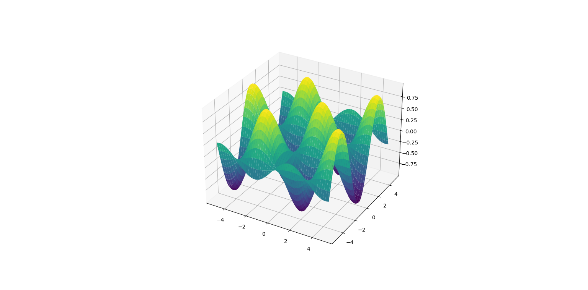

# Opt_Solver


[](https://travis-ci.org/yixuan/Opt_Solver)
[](https://coveralls.io/github/yixuan/Opt_Solver?branch=master)
[](https://github.com/yixuan/Opt_Solver/blob/master/LICENSE)
[](https://github.com/yixuan/Opt_Solver/releases)
[](https://github.com/yixuan/Opt_Solver/releases)

[Opt_Solver](https://github.com/wuzhe521/Opt_Solver) is a lightweight header-only C++ library for numerical optimization. It provides a set of numerical optimization algorithms, including gradient descent, conjugate gradient, Newton's method, Levenberg-Marquardt, BFGS, and more. It is designed to be easy to use and efficient.




```bash
The library is organized as follows:
|---core
|---|---algebra
|---|---config
|---|---constant
|---|---function
|---|---gradientsearch
|---|---linearsearch
|---|---matrix
|---|---newton
|---|---utilities
|---|---vector
|---doc
|---|---pics
|---|---tutorials.md
|---test
|---|---test_function.cc
|---tool
|---readme.md
```
This work is still developing, im trying my best on it. if u have some problem or suggestuin plz contact me [email](mailto:wuzhe0902#163.com)

<font size="5" color = "blue">  There will be a time to ride the wind and waves, and set sail to cross the vast ocean. </font>
