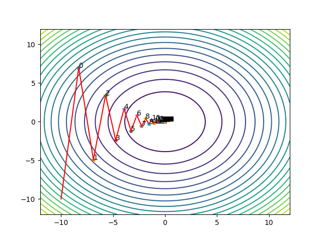
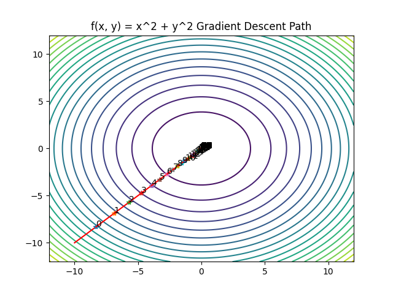
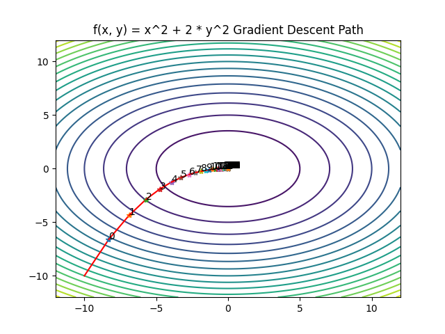
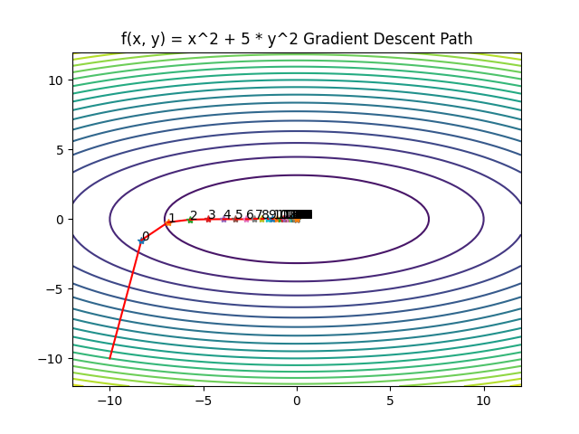
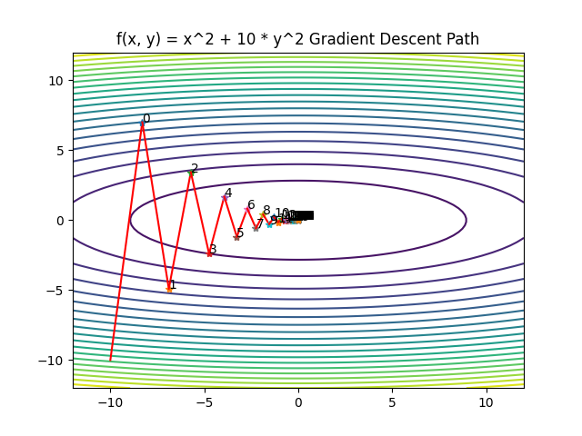

# Gradient Based Search

梯度类算法，其本质是仅仅使用函数的一阶导数信息选取下降方向 $d^k$. 其中最基本的梯度类算法为梯度下降法，直接选取负梯度作为下降方向．
梯度下降法的方向选取非常直观，实际应用范围非常广，因此它在优化算法中的地位可相当于高斯消元法在线性方程组算法中的地位．


对于函数 $f(x, y) = x^2 + 10*y^2$， 其一阶导数为 $\frac{\partial f}{\partial x} = 2x$, $\frac{\partial f}{\partial y} = 20y$, 因此其负梯度为 $-2x, -20y$, 因此其下降方向为 $-2x, -20y$, 其下降方向的选择是基于一阶导数的。
梯度下降法的演示代码如下：
```python
import numpy as np
import matplotlib.pyplot as plt


plt.figure()
x = np.linspace(-12, 12, 100)
y = np.linspace(-12, 12, 100)
X, Y = np.meshgrid(x, y)
Z = X**2 + Y**2
plt.contour(X, Y, Z, 20)

def f(x):
    return x[0]**2 + 10 * x[1]**2
    
def df(x):
    return np.array([2*x[0], 20*x[1]])
x0 = np.array([-10.0, -10.0])
x = []
x.append(x0)
max_iter = 100
step_size = 0.085
for i in range(max_iter):
    x_new = x[-1] - step_size * df(x[-1])
    x.append(x_new)
    plt.plot([x[-2][0], x_new[0]], [x[-2][1], x_new[1]], 'r-')
    plt.plot(x_new[0], x_new[1], '*', )
    plt.text(x_new[0], x_new[1], f'{i}')

    print(f'Iteration {i}: x = {x_new}, f(x) = {f(x_new)}')
    if np.linalg.norm(df(x[-1])) < 1e-6:
        break
    if i == max_iter - 1:
        print('Maximum number of iterations reached')
    
plt.plot(x[-1][0], x[-1][1], '*')
plt.show()
```
在等高线视图中，依次画出梯度下降路径，如下：




在固定算法的基础上，将固定步长改为自适应步长，步长的求解方式采用线搜索方法的Armijo方法，就实现了梯度类算法，
总体逻辑：
1. 输入初始点 $x_0$，初始步长 $\alpha_0$，最大迭代次数 $max\_iter$，步长缩减因子 $\beta$，步长增加因子 $\gamma$，精度 $\epsilon$
2. 迭代 $i = 0, 1, 2, ..., max\_iter$ 
3. 计算当前点 $x_i$ 的一阶导数 $g_i$, 函数值 $f_i$,
4. 根据当前点 $x_i$ 的函数值 $f_i$ 和导数 $g_i$，用线搜算法计算当前点 $x_i$ 的下降步长 $\beta_i$
5. 更新 $x_{i+1} = x_i - \beta_i g_i$
6. 判断当前点 $x_{i+1}$ 的函数值 $f_{i+1}$ 和上一次点 $x_i$ 的函数值 $f_i$差是否小于精度 $\epsilon$，小于则迭代结束，否则继续迭代
梯度类算法的实现代码如下：
```cpp
template <typename Function, typename X> class GradientDescentSearch {
  struct gradient_descent_parameters {
    double tolerance = 1.0e-6;
    GONS_UINT max_iterations = 1000;
    bool verbose = false;
  };
  enum class gradient_descent_state { SUCCESS, FAILURE, MAX_ITERATION_REACHED };

public:
  // Corrected constructor with matching initialization order
  GradientDescentSearch(const Function &f, const X &x) 
      : f_(f), x_(x), linear_search_(f, x){}

  ~GradientDescentSearch() = default;
  void set_params(const gradient_descent_parameters &parameters) {
    parameters_ = parameters;
  }
  double SearchStep(const X &x, const Function &f) {
    return linear_search_.Search(x, f);
  }
  gradient_descent_state Optimize() {
    GONS_UINT iter = 0;
    GONS_UINT max_iter = parameters_.max_iterations;
    GONS_FLOAT tolerance = parameters_.tolerance;

    while (iter < max_iter) {
      // 计算梯度
      X gradient = f_.gradient(x_);

      // 计算步长
      double step = SearchStep(x_, f_);

      // 更新x
      X x_new = x_ - step * gradient;
      if (parameters_.verbose) // 打印信息
      {
        LOG("Iteration: " << iter);
        LOG("x = " << x_);
        LOG("f(x) = " << f_(x_));
        LOG("Step = " << step);
      }
      if (std::abs(f_(x_new) - f_(x_)) < tolerance) {
        LOG_WARNING("After " << iter << " iterations");
        LOG_WARNING("Gradient descent converged.");
        LOG_WARNING("x = " << x_);
        LOG_WARNING("f(x) = " << f_(x_));
        return gradient_descent_state::SUCCESS;
      }

      x_ = x_new;
      iter++;
    }
    LOG_WARNING("After " << iter << " iterations");
    LOG_WARNING("Gradient descent did not converge.");
    LOG_WARNING("x = " << x_);
    LOG_WARNING("f(x) = " << f_(x_));
    return gradient_descent_state::MAX_ITERATION_REACHED;
  }

private:
  Function f_;
  X x_;
  ArmijoSearch<Function, X> linear_search_;
  gradient_descent_parameters parameters_;

};
```
测试代码如下：
```cpp
TestFunction f;
X x = {1.0, 1.0};
gons::GradientDescentSearch<TestFunction, X> gd(f, x);
gd.Optimize();
```
运行结果如下：
```bash
After 14 iterations
Gradient descent converged.
x = 0.000783642 0.000783642 
f(x) = 1.22819e-06
```

## 条件数对求解的影响
我们依次画出函数 $f(x) = x^2 + y^2$,   $f(x) = x^2 + 2* y^2$,   $f(x) = x^2 + 5 *y^2$ 和$f(x) = x^2 + 10* y^2$ 的梯度下降路径:
<div align="center">
 
 
 
 
</div>
将函数写成矩阵形式表达， 可以得到：

$$ f_1(x) = \begin{bmatrix} x \\ y \end{bmatrix}^T \begin{bmatrix} 1 & 0 \\ 0 & 1 \end{bmatrix} \begin{bmatrix} x \\ y \end{bmatrix} $$  
$$ f_2(x) = \begin{bmatrix} x \\ y \end{bmatrix}^T \begin{bmatrix} 1 & 0 \\ 0 & 2 \end{bmatrix} \begin{bmatrix} x \\ y \end{bmatrix} $$  
$$ f_3(x) = \begin{bmatrix} x \\ y \end{bmatrix}^T \begin{bmatrix} 1 & 0 \\ 0 & 5 \end{bmatrix} \begin{bmatrix} x \\ y \end{bmatrix} $$  
$$ f_4(x) = \begin{bmatrix} x \\ y \end{bmatrix}^T \begin{bmatrix} 1 & 0 \\ 0 & 10 \end{bmatrix} \begin{bmatrix} x \\ y \end{bmatrix} $$  

可以看到，当Hessin矩阵的条件数$k = \lambda_{max}/\lambda_{min}$越大，梯度下降法的收敛速度越慢，当条件数越小时，梯度下降法的收敛速度越快。因为条件数越大，意味着在某个维度上，函数的变化越剧烈，在梯度下降法中，梯度越剧烈，下降的步长越大，因此梯度下降法的收敛速度越慢。

## Barzilai-Borwein 方法
因为，当问题的条件数很大，也即问题比较病态时，梯度下降法的收敛性质会受到很大影响。
Barzilai-Borwein 方法是一种基于梯度下降法的方法，其基本思路是使用梯度下降法的方向和步长来更新参数，而不是使用一阶导数来更新参数。
BB 方法选取的 αk 是如下两个最优问题之一的解：
$$\min\limits_{\alpha} ||\alpha y^{k-1} - s^{k-1}||^2$$
$$\min\limits_{\alpha} || y^{k-1} - \alpha^{-1}s^{k-1}||^2$$
其中：$s^{k−1} = x^k − x^{k−1}$，$y^{k-1} = \bigtriangledown f{k} - \bigtriangledown f^{k-1}$，容易验证，两个最优问题的解分别为：

$$\alpha^k BB1 = \frac{(s^{k-1})^Ty^{k-1}} {(y^{k-1})^Ty^{k-1}}$$

$$\alpha^k BB2 = \frac{(s^{k-1})^T s^{k-1}}{(s^{k-1})^Ty^{k-1}}$$

得到两种迭代格式:
$$x^{k+1} = x^k - \alpha^k BB1 \bigtriangledown f^{k}$$
$$x^{k+1} = x^k - \alpha^k BB2 \bigtriangledown f^{k}$$

对于一般的问题，计算出的步长可能过大或过小，因此我们还需要将步长做上界和下界的截断

Barzilai-Borwein 方法的实现代码如下：
```cpp
template <typename Function, typename X> class BarzilaiBorwein {
  enum class SearchMethod { BB1, BB2 };
  struct BarzilaiBorweinParameters {
    // linear search rule parameters
    double c = 0.1;
    double beta = 0.333;
    // limit step size in a reasonable range
    double alpha_upper = 1e10;
    double alpha_lower = 1e-10;
    // initial step size
    double alpha = 0.01;
    // gradient descent parameters
    double tolerance = 1.0e-6;
    int max_iterations = 10;

    bool verbose = false;
    SearchMethod method = SearchMethod::BB2;
  };
  enum class BarzilaiBorweinStatus { SUCCESS, FAILURE, MAX_ITERATION_REACHED };

public:
  BarzilaiBorwein(const Function &f, const X &x) : f_(f), lastGradient_(x), lastX_(x) {
    lastGradient_ = f_.gradient(lastX_);
  }
  double SearchStep(const X &x_new, const X &grad_new, const Function &f) {

    X s_k1 = x_new - lastX_;
    X y_k1 = grad_new - lastGradient_;

    double alpha = 1.0;

    switch (parameters_.method) {
    case SearchMethod::BB1: {
      // 检查分母是否为零
      FLT_EQUAL_ZERO(y_k1.dot(y_k1));
      alpha = s_k1.dot(y_k1) / y_k1.dot(y_k1);
      break;
    }
    case SearchMethod::BB2: {
      // 检查分母是否为零
      FLT_EQUAL_ZERO(y_k1.dot(y_k1));
      alpha = s_k1.dot(s_k1) / s_k1.dot(y_k1);
      break;
    }
    default:
      LOG_WARNING("Unsupported search method.");
      return 0.0;
    }
    return alpha;
  }

  // 优化方法
  BarzilaiBorweinStatus Optimize() {
    int iter = 0;

    while (iter < parameters_.max_iterations) {
      //
      X x_new = lastX_ - parameters_.alpha * lastGradient_;
      // 计算梯度
      X gradient_new = f_.gradient(x_new);

      // 更新x
      double step = SearchStep(x_new, gradient_new, f_);

      // 限制步长在合理范围内
      parameters_.alpha = step > parameters_.alpha_upper
                        ? parameters_.alpha_upper
                        : step;
      parameters_.alpha = step < parameters_.alpha_lower
                        ? parameters_.alpha_lower
                        : step;
    
      // 更新x 和梯度
      lastX_ = x_new;
      lastGradient_ = gradient_new;

      iter++;
      if (parameters_.verbose) // 打印信息
      {
        LOG("Iteration: " << iter);
        LOG("x = " << lastX_);
        LOG("f(x) = " << f_(lastX_));
        LOG("Step = " << step);
      }

      // 检查梯度是否足够小
      if (lastGradient_.Norm2() < parameters_.tolerance) {
        LOG_WARNING("After " << iter << " iterations");
        LOG_WARNING("Barzilai-Borwein converged.");
        LOG_WARNING("x = " << lastX_);
        LOG_WARNING("f(x) = " << f_(lastX_));
        return BarzilaiBorweinStatus::SUCCESS;
      }
    }

    // 检查是否达到最大迭代次数
    if (iter == parameters_.max_iterations) {
      LOG_WARNING("After " << iter << " iterations");
      LOG_WARNING("Barzilai-Borwein did not converge.");
      LOG_WARNING("x = " << lastX_);
      LOG_WARNING("f(x) = " << f_(lastX_));
      return BarzilaiBorweinStatus::MAX_ITERATION_REACHED;
    }
  }

private:
  Function f_;
  X lastGradient_;
  X lastX_;
  BarzilaiBorweinParameters parameters_;
};
```
测试代码如下：
```cpp
gons::BarzilaiBorwein<TestFunction, X> bb(f, x);
bb.Optimize();
```
运行结果如下：
```bash
After 9 iterations
Barzilai-Borwein converged.
x = 5.81481e-13 1.83207e-23 
f(x) = 3.3812e-25
```
[注：BB 方法在实践中，无论选BB1 还是 BB2，收敛速度和精度都比梯度下降法要好。]