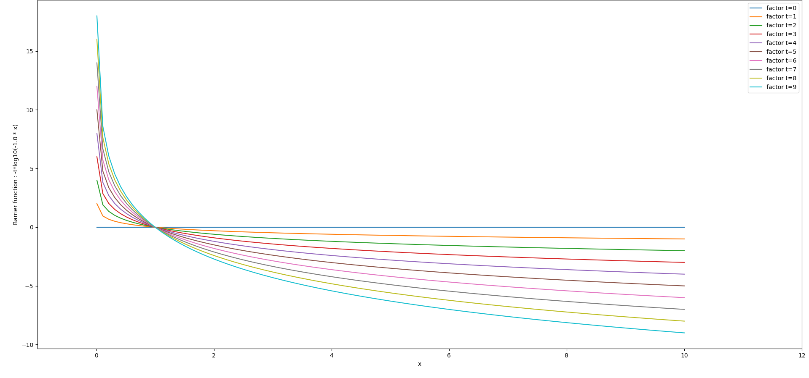

# 内点法
普通的二次罚函数法也叫做外罚函数法，是一种基于二次罚函数的优化方法。因为它对每一步解的范围没有要求，从求解过程来看，其产生的解的序列极有可能是从约束范围之外慢慢接近约束边界。
内点法,也常叫做障碍函数法，是一种基于内罚函数的优化方法，它要求解的序列必须位于约束范围内。内点法在求解过程中，每次迭代的解必须位于约束范围内，否则会得到一个系统错误。  
对于一般的优化问题：
$$ \min f(x) $$
$$ \text{s.t. } x \in \mathcal{C} $$
Interior method typically employ a two-phase approach:
- first phase to find a feasible solution 
- second phase to refine the solution to optimality.  

## 约束优化问题
  约束优化问题的一般形式为：
  $$ \min f(x) $$
  $$ \text{s.t. } g_i(x) \leq 0, i = 1, \ldots, m $$
  $$ h_j(x) = 0, j = 1, \ldots, p $$

  - 目标函数 f(x)， 约束函数 g_i(x)， 边界条件 h_j(x) 可以是线性函数，也可以是非线性函数。
  - 通常都是凸函数，对应着凸优化问题。
  - 用松弛变量法将任意形式的不等式约束转化为简单的不等式约束。

## 松弛变量法
对于约束优化问题中的不等式约束 $g_i(x) \leq 0, i = 1, \ldots, m$, 可以转化为另一种形式：$g_i(x) + s_i = 0, i = 1, \ldots, m$, 其中 $s_i \geq 0, i = 1, \ldots, m$，这样我们就可以把一般形式的约束优化问题，转化为简单的约束优化问题：
$$ \min f(x) $$
$$ \text{s.t. } g_i(x) + s_i = 0, i = 1, \ldots, m$$ 
$$ h_j(x) = 0, j = 1, \ldots, p $$
$$ s_i \geq 0, i = 1, \ldots, m $$

## 障碍函数法
当我们通过松弛变量法得到了更加简单的约束优化问题的表达形式后，我们发现，约束条件中还是有意向不等式约束$s \geq 0$，这时，我们可以使用障碍函数法来解决。我们希望得到一个关于s的函数,满足当$s<0$时，$I_(s) = 0$， 当$s \geq 0$时，$I_(s) = +\infty$。 我们把这个函数加到目标函数中，得到新的目标函数。这个函数的最优值就是我们希望得到的满足约束$s\geq 0$ 目标函数的最小值。
$$ Obj(x, s) = f(x ) + I_s(x) $$

如何才能逼近这种函数呢？天然的我们想到了对数函数：$log(x)$的性质，我们构建一个对数函数: $-t *log(s)$ 其函数图像：

当s 越接近0时，所构建的函数越接近无穷。

## 障碍函数法的KKT条件
通过障碍函数法，我们将原来的一般约束优化问题，转化为了一个简单的约束优化问题：
$$ \min f(x) - \mu *ln(s) $$
$$ \text{s.t.} g_i(x, s) = 0 $$

我们得到这个问题的拉格朗日函数为：
$$ L(x,s, \lambda, \mu) = f(x) - \mu *ln(s) + \lambda^T(g_i(x)) $$
$$ L(\bar x, \lambda, \mu) = f(\bar x) - \mu *ln(\bar x) + \lambda^T(g_i(\bar x)) \\ a.t. \quad \bar x = \begin{bmatrix} x \\ s \end{bmatrix} $$
令： $Z = \{z_i = \frac{\mu}{\bar x_i} | i = n..m \}$我们写出这个问题的KKT条件为：
$$ \nabla f(\bar x) - Z + \lambda \nabla g_i(\bar x)= 0 $$
$$ g_i(\bar x) = 0 $$
$$ \bar x * Z  - \mu = 0 $$

## 用newton法求解 障碍函数的KKT条件

$$ L(\bar x, \lambda, \mu) = f(\bar x) - \mu *ln(\bar x) + \lambda^T(g_i(\bar x)) $$
$$
\frac{\nabla L}{\nabla \bar x} = \nabla f(\bar x) - Z + \lambda \nabla g_i(\bar x) \\
\frac{\nabla L}{\nabla \lambda} = g_i(\bar x) \\
\frac{\nabla L}{\nabla \mu} = \bar x * Z - \mu $$  
计算L的Hessian矩阵：  
$$ \begin{aligned}
\nabla^2_{\bar x \bar x} L &= \nabla^2_{\bar x \bar x} (\nabla f(\bar x) - Z + \lambda \nabla g_i(\bar x))  = W_{xx}\\
\nabla^2_{\bar x \lambda} L  &= \nabla g_i(\bar x) \\
\nabla^2_{\bar x Z} L &= -I \\
\nabla^2_{\lambda Z} L  &= 0 
\end{aligned} $$
可以得到Hessian矩阵为: 
$$ 
\begin{aligned}
\nabla^2_ L &= \begin{bmatrix}\nabla^2_{\bar x \bar x} L & \nabla^2_{\bar x \lambda} L & \nabla^2_{\bar x Z} L \\
\nabla^2_{\lambda \bar x} L & \nabla^2_{\lambda \lambda} L & \nabla^2_{\lambda Z} L \\
\nabla^2_{Z \bar x} L & \nabla^2_{Z \lambda} L & \nabla^2_{Z Z} L \\
\end{bmatrix} \\
&= \begin{bmatrix}
   W_{xx} & \nabla g_i(\bar x) & -I \\
   \nabla g_i(\bar x)^T & 0 & 0 \\
   -I & 0 & 0
\end{bmatrix}
\end{aligned}
$$  
根据经典牛顿法的更新格式：  
$$x^{k+1} = x^k - \bigtriangledown^2 f(x^k)^{-1} \bigtriangledown f(x^k)$$  
可以得到

